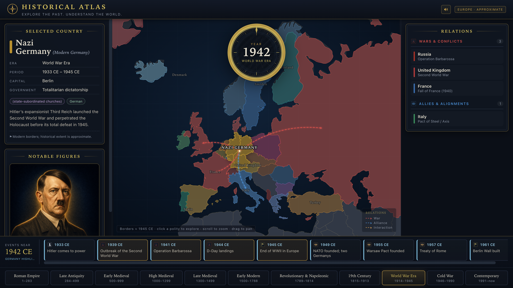

# Historical Atlas



So here's the gist: it's an interactive map of Europe you can scrub through time. Spin the year
dial from **0 AD all the way to today** and the borders morph era by era — Rome, the Carolingians,
the messy patchwork of the Holy Roman Empire, nation-states, the EU. Click on any country and it
lights up: who ran it, its capital and government, who it was at war with (red arrows), who it
allied with (blue), the people who mattered, and the big events happening around that year.

The shot above is **1942 with Nazi Germany selected** — you can see the war arrows reaching toward
the USSR and Britain, and the Axis link down to Italy.

It's a desktop app (**Electron + React + TypeScript + Vite**), but the whole thing is really just a
web UI under the hood (SVG + d3-geo + a little Web Audio), so you can run it right in a browser too.

## Features

- **Borders that change with time** — the map redraws to the nearest of ~23 period snapshots
  (Roman Empire → Carolingian → fragmented HRE → nation-states → EU).
- **Click any polity** — it highlights, the view eases toward it, and arrows fan out to the
  states it warred with (red), allied with (blue), or otherwise engaged (orange).
- **Per-era info panels** — government, capital, religion/culture, a summary, and large painted
  **figure portraits** for each period.
- **Interactive year dial** — drag, scroll, or arrow-key through time.
- **Sound** — a ticking dial, soft UI clicks, and a cloth rustle on selection (mute toggle in
  the top bar).

> Borders are **approximate** historical reconstructions on rough-period snapshots, and big
> empires are clickable as a single representative country. See [SOURCES.md](SOURCES.md).

## Prerequisites

You only need two things:

| | |
|---|---|
| **[Node.js](https://nodejs.org) 18 or newer** | ships with `npm`; the project is developed on Node 20–24 |
| **[Git](https://git-scm.com)** | to clone the repo |

No databases, no API keys, no native build tools. Everything (map data, fonts, sounds) is
bundled or generated locally — the app makes **no network requests at runtime**. Works on
**macOS, Windows, and Linux**.

## Quick start

```bash
git clone https://github.com/dvelkow/historical-atlas.git
cd historical-atlas
npm install          # installs dependencies (incl. Electron) — first run downloads ~a few hundred MB

npm run dev          # launch the desktop app (hot reload)
#   — or —
npm run web          # run just the UI in your browser at http://localhost:5199
```

That's it. `npm run dev` opens the Electron window; `npm run web` is handy if you just want to
poke at the interface in a browser.

## Scripts

| Script | What it does |
|---|---|
| `npm run dev` | Full Electron app with hot reload. |
| `npm run web` | Renderer only, in a browser (port 5199). |
| `npm run build` | Production Electron build into `out/`. |
| `npm start` | Preview the built app (`electron-vite preview`). |
| `npm run dist:win` | Package a **Windows** x64 installer **+** portable `.exe` into `release/`. |
| `npm run dist:mac` | Package a **macOS** app/dmg into `release/`. |
| `npm run typecheck` | Type-check the renderer. |

> Packaging (`dist:*`) downloads the matching Electron binaries on first run and builds on
> macOS without Wine. Produced apps are **unsigned**, so Windows SmartScreen / macOS Gatekeeper
> will warn on first launch (choose *More info → Run anyway* / right-click → Open).

## Project structure

```
src/
  main/ · preload/       Electron shell (window, lifecycle, IPC bridge)
  renderer/src/
    App.tsx              State + layout
    components/          WorldMap, YearDial, panels, FigureCard, …
    data/                eras, events, country files (+ periods/relations/figures),
                         historical-border loader, name→country aliases
    map/projection.ts    Europe Mercator projection
    audio.ts             Web Audio sound effects
    assets/              border TopoJSON, icon/figure/compass PNGs
scripts/build-borders.cjs  Rebuilds the period-border data from the source dataset
```

## Extending it

The data is plain, well-typed TypeScript designed to be edited:

- **Add a country:** drop a new file in `src/renderer/src/data/countries/` (it's auto-discovered).
  See [`countries/README.md`](src/renderer/src/data/countries/README.md).
- **Add a figure portrait:** drop a PNG named per [FIGURES.md](FIGURES.md) into
  `src/renderer/src/assets/figures/` — it appears automatically.
- **Border epochs / aliases:** [`scripts/build-borders.cjs`](scripts/build-borders.cjs) and
  [`borderAliases.ts`](src/renderer/src/data/borderAliases.ts).

A full engineering brief for contributors is in [HANDOFF.md](HANDOFF.md).

## Data, assets & licenses

- Application code: **MIT** (see [LICENSE](LICENSE)).
- Historical borders: the open **[historical-basemaps](https://github.com/aourednik/historical-basemaps)**
  dataset, which is **GPL-3.0** — fine for personal/educational use; mind the copyleft terms if
  you redistribute. Full details and every bundled asset's license are in [ASSETS.md](ASSETS.md);
  historical sourcing and caveats are in [SOURCES.md](SOURCES.md).
- Icons and figure portraits are custom/placeholder art (see [DESIGN_ASSETS.md](DESIGN_ASSETS.md),
  [FIGURES.md](FIGURES.md)).
